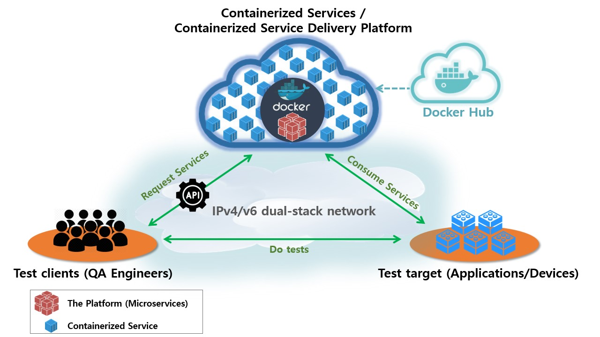
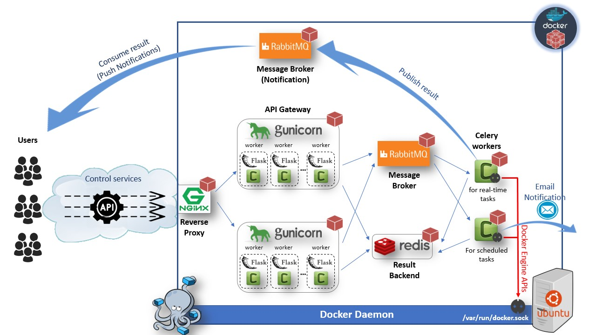
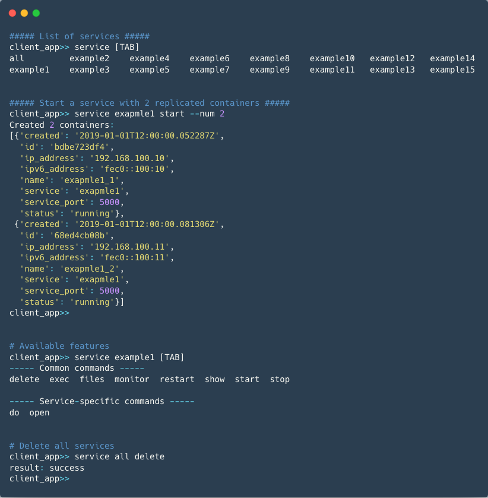
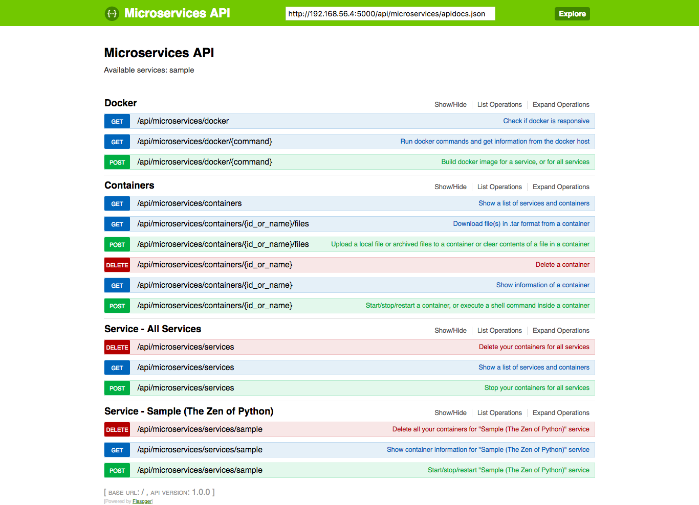
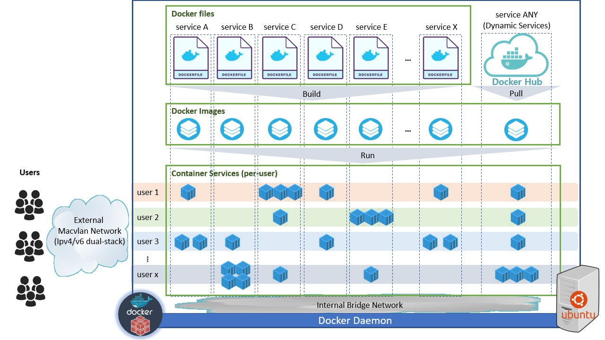
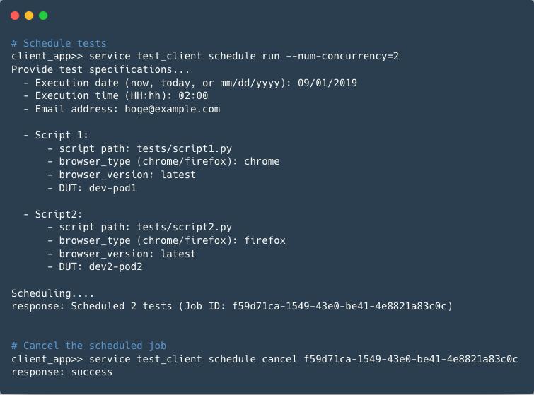

Containerized Service Delivery Platform (Microservices)
===============================================================


This repository was created to share high-level details of one of my original applications that I planned, designed, and developed from scratch in my professional environment.  
The level of information here is limited based on permissions granted by my manager.


## Table of Contents
- [1. Introduction](#1-introduction)
- [2. Project Overview](#2-project-overview)
    + [1) Multi-container Docker Application (The Platform)](#1--multi-container-docker-application--the-platform-)
    + [2) Containerized Services (Services)](#2--containerized-services--services-)
    + [3) Client Interfaces (Clients)](#3--client-interfaces--clients-)
- [3. Service Features](#3-service-features)
    + [1) Common Features](#1--common-features)
    + [2) Service-specific Features](#2--service-specific-features)
- [4. Asynchronous Processing with Celery](#4-asynchronous-processing-with-celery)
    + [1) API Request Flows](#1--api-request-flows)
    + [2) Celery Workflows](#2--celery-workflows)
- [5. Featured Use Cases](#5-featured-use-cases)
    + [1) UI testing for multiple browsers/versions (Selenium Automation)](#1--ui-testing-for-multiple-browsers-versions--selenium-automation-)
    + [2) Parallel Test Execution (On-demand / Scheduling)](#2--parallel-test-execution--on-demand---scheduling-)

<br>

## 1. Introduction  
Containerized Service Delivery Platform (Microservices) is a scalable multi-container Docker application which delivers remote users a collection of containerized QA applications as a "per-user" on-demand service.

Once a new containerized service is built and published onto it, users can control/manage their own dedicated containers by quickly starting the service via the Restful API interface, and can consume those service features by directly accessing the container's routable IPv4/v6 addresses.  

Each containerized service is designed to achieve a specific goal during QA testing. Therefore services are highly disposable and are expected to serve for short period of time - Containers can be quickly spun up, and can be deleted once the job is done.

Although Docker is one of the core technologies used for the application, users don't need to know or have any Docker skills to consume services since all interactions between users and the application are done via Restful APIs. Moreover, client CLI tool abstracts API requests by converting them to intuitive commands: ``<service_name> + <action> + [options]``


## 2. Project Overview

#### 1) Multi-container Docker Application (The Platform)
The application consists of multiple containerized nodes which are managed with ``docker-compose``. Some components can be easily scaled up with ``scale`` option.  eg. ``docker-compose up --scale api_gateway=2 celery_worker=3``

**Application Architecture**



**Building Blocks**
- Nginx (nginx:alpine)
    + Reverse proxy
    + Load balance requests

- Flask/Gunicorn (python:3.6-alpine)
    + Restful API Gateway
    + Python Flask application (per-service modular architecture)
    + WSGI Server with asynchronous Gevent workers and Celery producers

- RabbitMQ (rabbitmq:alpine)
    + Message broker for Celery tasks
    + Message broker for result push notifications

- Celery workers (python:3.6-alpine)
    + Task queues for real-time service requests (Multi-threading)
    + Task queues for scheduled requests (Multi-processing)
    + Docker client (Access dockerd through mounted /var/run/docker.sock)

- Redis (redis:alpine)
    + Result backend for Celery
    + in-memory database


#### 2) Containerized Services (Services)
The application delivers containerized per-user services on-demand. Each service consists of one or more containers which other users can't touch. Since those containers are connected to the external IPv4/v6 dual-stack Macvlan network, each container has routable IPv4/v6 addresses, and exposed port numbers can be overlapped among other containers for the service, or other users' containers.  
This design enables users to spin up N number of replicated containers at the same time with the same port numbers and different IP addresses.  
(For example, it is highly useful when you need to test a feature where DUT sends messages to multiple external servers using a standard network protocol, such as SNMP Trap, Syslog etc, where you can't change which port number they listen on.)


**Per-user Service Delivery Model**
  


**Launched Services (18 services as of today)**

- Browser version on-demand (Standalone Selenium Server)
    + Chrome (selenium/standalone-chrome-debug)
    + Firefox (selenium/standalone-firefox-debug)  
      https://github.com/SeleniumHQ/docker-selenium

- Parallel Test Client
    + Client application and test frameworks (ubuntu:16.04)
    
- Network applications
    + SNMP Agent (snmpd/alpine:3.7)
    + SNMP Trap Receiver (snmptrapd/alpine:3.7)
    + Syslog Server (syslog-ng/alpine:3.7)
    + NTP Server (chronyd/alpine:3.7)
    + DNS Server (bind/alpine:3.7)
    + RADIUS Server w/ google authenticator (freeradiusd/ubuntu:16.04)
    + TACACS+ Server w/ google authenticator (tac_plus/ubuntu:16.04)
    + LDAP Server (openldap/ubuntu:16.04)
    + Network Scanner (nmap/alpine:3.7)
    + Log viewer (glogg 1.1.4/ubuntu:16.04)

- Company's in-house applications
    + Software Simulator for a next-generation product (ubuntu:16.04)
    + Restful API subscriber (Flask app/alpine:3.7)
    + Support site simulator (Flask app/alpine:3.7)

- Container Attacher
    + A socket relay server that attaches a client to a remote container's socket (Relays between TCP socket and remote docker.sock)  
      Client <-- TCP:10000 --> Container Attacher (Socket relay server) <-- docker.sock --> Traget Container

- Dynamimc Service Creation
    + Any applications (any docker images available on official docker hub)

    > Dynamic Service Creation is a special type of service which turns ANY public docker applications into a service manageble on the platform. A user can specify any docker images availeble on the official docker hub along with raw arguments passed to "docker run" command.  
    


#### 3) Client Interfaces (Clients)

##### (1) CLI
I also developed all client-side tools and libraries to access the application, such as Restful API client and service modules. They are all integrated into the existing console application. With the CLI, users can access Containerized Service Delivery Platform through a top-level command, like ``service``, which is the entry point of the application.  
All available commands are automatically converted to corresponding Restful APIs under the hood so that users won't need to deal with APIs directly.

**Examples**



##### (2) Python module
To automate processes, you can directly import the python module and use it in python scripts.

**Examples**  
```python
>>> from pprint import pprint
>>> from application import microservices
>>> 
>>> result = microservices.example1.start_service(num=2)
>>> pprint(result['containers'])
[{'created': '2019-01-01T12:00:00.052287Z',
  'id': 'bdbe723df4',
  'ip_address': '192.168.100.10',
  'ipv6_address': 'fec0::100:10',
  'name': 'exapmle1_1',
  'service': 'exapmle1',
  'service_port': 5000,
  'status': 'running'},
 {'created': '2019-01-01T12:00:00.081306Z',
  'id': '68ed4cb08b',
  'ip_address': '192.168.100.11',
  'ipv6_address': 'fec0::100:11',
  'name': 'exapmle1_2',
  'service': 'exapmle1',
  'service_port': 5000,
  'status': 'running'}]
>>> 
>>> result = microservices.all.delete_service()
>>> print(result)
{'result': 'success'}

```

##### (3) Swagger UI
The API Gateway implements Swagger UI. For development purposes, all API requests can be directly called on the UI.  

**Examples**



## 3. Service Features  

Available service features can be categorized with two groups - common features and service-specific features.


#### 1) Common Features  
All services, including Dynamic Service Creation, at least provide the following common container/service level management features.  
CLI syntax is something like `service <service_name> <mgmt_command> [<container_id_or_name> | all]`


| Mgmt command  | Equivalent Docker command                         | Description                                                       |
|-------------- |-----------------------------------------------    |----------------------------------------------------------------   |
| show          | docker ps / docker info                           | Show information about services                                   |
| start         | docker run /<br> docker create + docker start     | Start service with N number of replicated containers              |
| stop          | docker stop                                       | Stop a service                                                    |
| restart       | docker restart                                    | Restart a service                                                 |
| delete        | docker rm                                         | Delete a service or all services                                  |
| monitor       | -                                                 | Monitor service output                                            |
| files\*       | docker cp                                         | Upload files to a container<br>download files from a container    |
| exec          | docker exec                                       | Run a command inside a container                                  |
| logs          | docker logs                                       | Get container's log                                               |
| attach\*\*    | docker attach                                     | Attach to a remote container's socket via socket relay server     |

> Note: A service = N containers started for the service  
> \*: Remote file path completion is supported  
> \*\*: Bash tab completion is supported

#### 2) Service-specific Features
On top of above common features, each service provides variety of different service-specific features. I can not list everything here but these are the ones that make each service unique.    
For example, browser service has a feature "open browser" which connects a user to the container via VNC viewer, and opens a browser inside a container using another browser opener container (Selenium WebDriver) behind the scenes. DNS service has a feature "resolve name" which resolves a host name of containers you own to an IP address. test_client service has a feature "script schedule" which allows a user to schedule parallel execution of scripts at some future date/time, or run immediately, etc.


## 4. Asynchronous Processing with Celery
The application uses Celery to process most types of user requests as background tasks.  


#### 1) API Request Flows  
Handling user requests asynchronously drastically improves scalability since even though it is fast enough to spin up containers in general, it still takes several seconds to spin up 10 containers, which means the application resource is wasted while it is waiting. On the other hand, the Celery approach immediately frees up the application's resource to handle other user requests since tasks are asynchronously done in background.

The basic idea is the following:

1) Upon receiving a request from a user, issue a Job ID, submit the job, and return the Job ID as a response
2) Do the job in background
3) Publish the result to a message queue (Push Notification), or send email to the user
4) Client consumes the result from the queue, or receives the email


**Request Flows (eg. Start Service)**



#### 2) Celery Workflows
Service management requests are processed as chained Celery tasks instead of one big task. 
This approach helps me easily differentiate various and complex flows per service by combining reusable small tasks.

For example, the simplest service can be started in 4 steps.
1. Create a container
2. Start the container
3. Get container information
4. Push-notify result


On the other hand, some services take parameters and/or accept file uploading in the API request, and dynamically change their configuration or behavior for the user's preference. Or some services are designed to depend on another service, and the order of startup matters . In those cases, steps could be something more complex like below.

1. Create first container
2. Upload files to the container
3. Connect internal network
4. Start the container
5. Get container information (result1)
6. Create second container (from another service)
7. Connect internal network
8. Start the container
9. Get container information (result2)
10. Aggregate result1 and result2
11. Push-notify the result
12. Cleanup files


**Code Example: Chained tasks**

```python
from celery import chain, chord, group, uuid

import application.utilities as util
from application.celery import tasks


class ServiceExample1(BaseService):
    def __init__(self, service_name):
        super(ServiceExample1, self).__init__(service_name)

    def start_service(self, client_ip, num_containers=1, file=None):
        """Start Example1 service in background

        Arguments:
            client_ip (str): IP address of a client
            num_containers (int): Number of replicated containers to spin up
            file (FileStorage or File, optional): Files to upload into containers

        Returns:
            str: Job ID for the request
        """
        # Create a Job ID for the request (Will be used by the client to consume the result)
        job_id = uuid()

        # Create a temp file path for the file a user uploaded
        src_path = util.get_temp_file_path(file)
        dst_path = '/etc/example1/data'

        # Create workflow as chained tasks
        # create container -> upload files -> connect network -> start container -> get attributes
        chained_tasks = [
            chain(
                tasks.create_container.s(self.service_name, index, client=client_ip) |  # returns container ID
                tasks.upload_file(src_path=src_path, dst_path=dst_path) |               # returns container ID
                tasks.connect_network.s('service_internal_network') |                   # returns container ID
                tasks.start_container.s() |                                             # returns container ID
                tasks.get_container_info.s()                                            # returns container attributes in dictionary
            ) for index in range(num_containers)
        ]

        workflow = group(*chained_tasks)

        # Push-notify (publish) result upon the job is done, and cleanup files used
        job = chord(workflow.on_error(tasks.notify_error.si(job_id, clenup_files=src_path)),
                    tasks.notify_result.s(job_id, clenup_files=src_path))

        job.apply_async(queue='realtime', priority=10)

        return job_id

```

> Chord error handling was tricky as it doesn't work as documented (eg. https://github.com/celery/celery/issues/3709).  
> The chord usage in above example is supposed to be something like ``job = chord(workflow, tasks.notify_result.s().on_error(tasks.notify_error.s())``.
> But I found that a failure in the middle of the chain does not properly call on_error() if it is set on the callback, whereas it works when the last task in the chain fails.
> So I set it on the chord header instead as a workaround.


## 5. Featured Use Cases
#### 1) UI testing for multiple browsers/versions (Selenium Automation)
One of the handy use cases is a browser (chrome/firefox) version on-demand service for Selenium GUI testing. Since the browser containers are built from selenium/standalone-chrome-debug and selenium/standalone-firefox-debug images, it works as a standalone remote Selenium server where users can choose browser types (Chrome/Firefox) and browser versions on-demand. Each browser container is a dedicated Selenium server for a user.

> Building images for the latest chrome/firefox versions are automated as a periodical Celery task

**Examples: Start browser service with a browser version of your choice**


> MicrosoftEdge and Internet Explorer can be also containerized using Windows VMs on top of VirtualBox in Linux docker image. https://developer.microsoft.com/en-us/microsoft-edge/tools/vms/  
> Although I successfully containerized MicrosoftEdge and IE 10/11 with this approach, I didn't officially launch them as part of the browser service due to difficulties of automating Windows platform in general, and lack of Microsoft's official support of WebDriver implementation.


#### 2) Parallel Test Execution (On-demand / Scheduling)
Parallel Test Client service is a containerized version of a Linux VM which our team uses for day-to-day work/testing. The VM is basically a client application to access existing test frameworks. As I mentioned earlier, the client libraries for Containerized Delivery Platform are integrated as a module into the client application, which means containerized test clients have a full access to Containerized Service Delivery Platform inside from containers, such as starting other services.

Since it is now delivered as a containerized service where users can spin up multiple instances at the same time, we can run multiple tests in parallel using multiple test clients. And users can let Celery schedule them at a specific future date and time as well as running immediately.  
For example, we can achieve UI testing with multiple browsers and versions in parallel. Or we can upgrade the software version on multiple nodes in parallel.
Those tasks can be scheduled to start when you are sleeping, and you can receive the result by email when they are done.  
This use case will significantly reduce total amount of time you will use for your work. 

**Examples: Schedule parallel execution of scripts**



